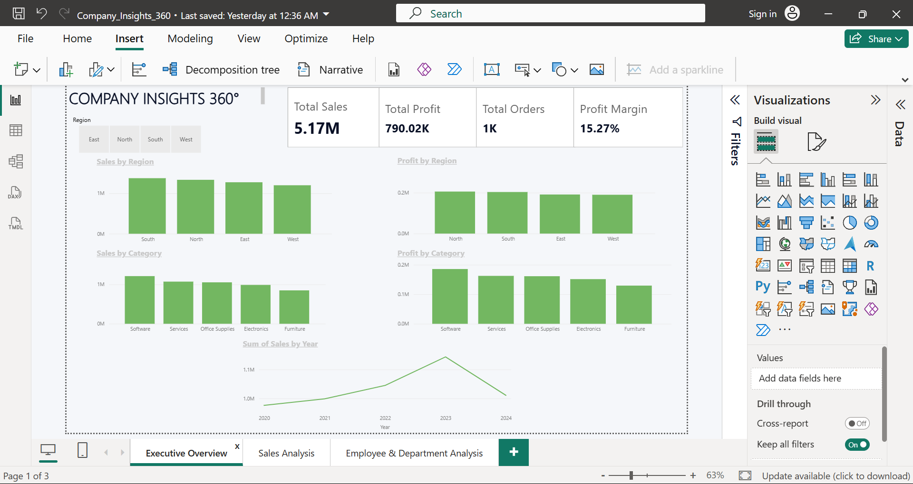
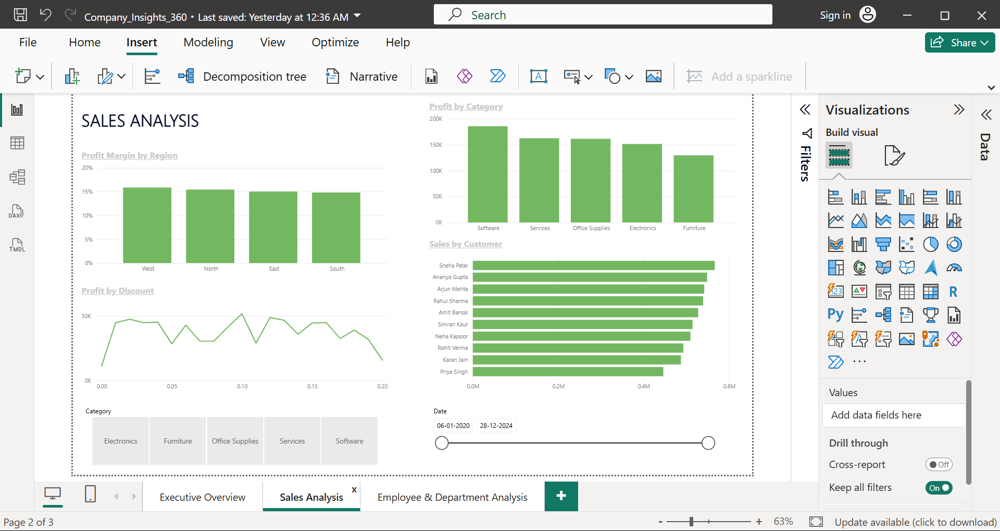
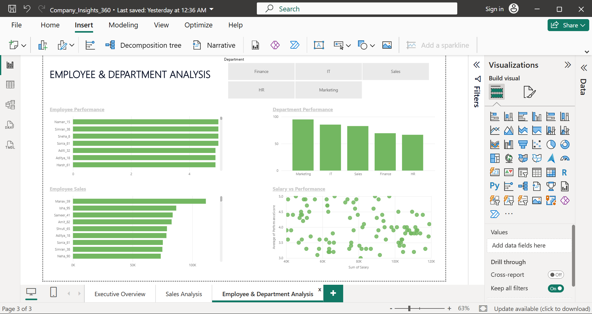

``# 📊 Company Insights 360°

An end-to-end business analytics project using **Python, SQL, and Power BI** to analyze company sales, profitability, customers, employees, departments, regions, and discounts.

## 🛠️ Tools & Technologies

- **Python** – Data cleaning and analysis
- **Pandas** – Data manipulation
- **SQL (SQLite)** – Queries, joins, aggregations, and KPIs
- **Power BI** – Interactive dashboards and visualization
- **DAX** – Business KPIs and measures
- **GitHub** – Version control and project portfolio

## 📂 Project Files

| File | Description |
|---|---|
| `Company_Insights_360.pbix` | Power BI dashboard |
| `company_analysis.py` | Python data analysis script |
| `company_analysis.sql` | SQL business analysis queries |
| `company_insights.db` | SQLite database |
| `departments.csv` | Department dataset |
| `employees.csv` | Employee dataset |
| `sales.csv` | Sales dataset |

## 📈 Business Analysis

This project analyzes:

- Overall company performance
- Sales and profit by region
- Category-wise sales and profit
- Employee performance
- Department performance
- Customer-wise sales and profit
- Year-wise sales trends
- Discount vs. profit
- Regional profit margins
- Category performance by region

## 🔑 Key KPIs

- **Total Sales:** 5.17M
- **Total Profit:** 790.02K
- **Total Orders:** 1,000
- **Total Customers:** 10
- **Profit Margin:** 15.27%
- **Average Discount:** 9.93%

## 💡 Key Business Insights

- **South** generated the highest total sales.
- **North** generated the highest total profit.
- **West** had the highest regional profit margin.
- **2023** recorded the highest annual sales.
- Sales declined in **2024** compared with 2023.
- Lower discount ranges generated stronger total profit in this dataset.
- Employee and department analysis highlights performance differences across the organization.

## 📊 Power BI Dashboard

The dashboard contains three pages:

### 1. Executive Overview
- KPI cards
- Sales by Region
- Profit by Region
- Sales by Category
- Profit by Category
- Year-wise Sales Trend
- Region filter

### 2. Sales Analysis
- Profit Margin by Region
- Profit by Category
- Profit by Discount
- Sales by Customer
- Category filter
- Date filter

### 3. Employee & Department Analysis
- Employee Performance
- Department Performance
- Employee Sales
- Salary vs Performance
- Department filter

## 🔄 Project Workflow

**Raw Data → Python → SQL → Power BI → Business Insights**

## 🎯 Project Objective

To transform raw business data into meaningful insights and build an interactive business intelligence solution using Python, SQL, and Power BI.

## 👩‍💻 Author

**Shravani Shahakar**

B.E. Graduate | Aspiring Data Analyst

## 📊 Power BI Dashboard

### Executive Overview

### Sales Analysis

### Employee & Department Analysis

